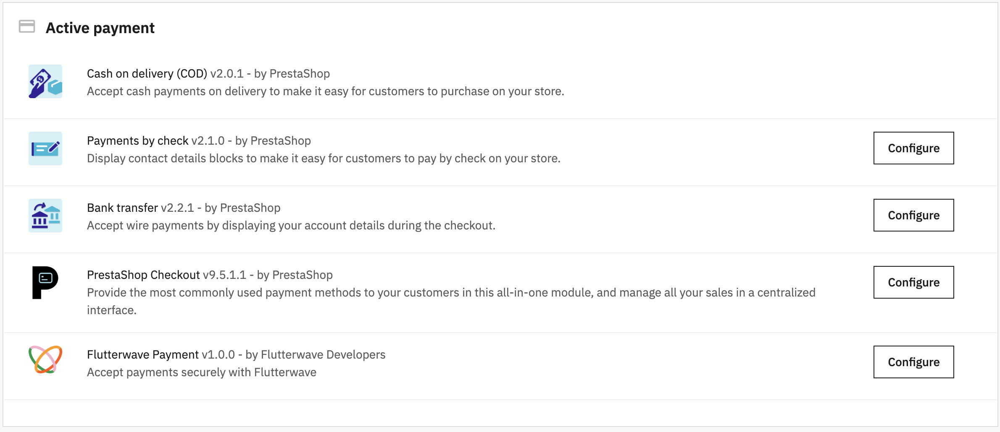

# Flutterwave PrestaShop Payment Module

The official PrestaShop module for accepting payments via Flutterwave.

---

## Overview

The Flutterwave PrestaShop module enables merchants to securely accept online payments directly in their PrestaShop store using Flutterwave’s hosted checkout.

With this module, merchants can:

- Accept global and local payments securely  
- Support multiple payment methods (cards, bank transfers, mobile money, wallets)  
- Automatically verify payments  
- Receive real-time webhook updates  
- Seamlessly switch between Test and Live modes  

---

## Installation

### Option 1 — Install from Source
1. Download or clone this repository.
2. Copy the `flutterwavepayment` folder into your PrestaShop `/modules` directory.
3. In your PrestaShop Admin panel:
   - Go to **Modules → Module Manager**
   - Search for **Flutterwave**
   - Click **Install**
4. Click **Configure** and enter your API credentials.

### Option 2 — Upload as ZIP
1. Zip the `flutterwavepayment` folder.
2. Go to **Modules → Module Manager**.
3. Click **Upload a module**.
4. Upload the ZIP file and install.
5. Configure the module with your Flutterwave credentials.

### Option 3 - Developer Friendly
For the step-by-step guide on this option use the guide [here](/docs/DOCKER_COMPOSE_INSTRUCTIONS.md)

---

## Configuration

After installation:

1. Get your API keys from the Flutterwave Dashboard.  
2. Navigate to **Modules → Module Manager → Flutterwave → Configure**.  
3. Enter your:
   - Public Key  
   - Secret Key  
   - Webhook Secret (recommended)  
4. Select your operating mode:
   - **Test Mode** (Sandbox)
   - **Live Mode** (Production)
5. Save changes.

---

## Key Features

### Secure Payment Processing
- Hosted checkout powered by Flutterwave
- PCI-DSS compliant payment flow
- Multi-currency support
- Automatic order creation on successful payment

### Webhook Integration
- Real-time payment updates
- Automatic order status synchronisation
- Webhook signature verification
- Support for success and failure events

### Built for Reliability
- Secure API authentication
- HTTPS-only payment flow
- Detailed logging and debugging
- Resilient retry mechanisms

---

## Payment Flow

1. **Customer Checkout**
   - Customer selects **Pay with Flutterwave**
   - A payment session is created via Flutterwave API
   - Customer is redirected to Flutterwave hosted payment page

2. **Payment Processing**
   - Customer completes payment securely on Flutterwave

3. **Verification**
   - Flutterwave sends a webhook notification
   - Module verifies the transaction via API
   - Order status is updated automatically

4. **Order Confirmation**
   - Customer returns to confirmation page
   - Order email is sent
   - Payment is recorded in PrestaShop

---

## API Endpoints Used

The module integrates with the following Flutterwave APIs:

- **Initialize Payment**  
  Creates a payment session and returns checkout link.

- **Verify Transaction**  
  Confirms payment status after checkout.

- **Webhooks**  
  Receives real-time payment notifications.

For full documentation, visit the Flutterwave Developer Docs.

---

## Testing

### Test Mode
1. Enable **Test Mode** in module settings
2. Use Flutterwave sandbox keys
3. Perform test transactions
4. Confirm orders are created successfully

### Webhook Testing
1. Configure webhook URL in Flutterwave Dashboard
2. Send test events
3. Confirm order status updates in PrestaShop logs

---

## Requirements

- PrestaShop **1.7+**
- PHP **7.1+**
- PHP extensions: **cURL**, **JSON**
- Active Flutterwave account

---

## Support

- Developer Documentation: Flutterwave Docs  
- Support: hi@flutterwave.com  
- Check PrestaShop logs in `/var/logs/`

---

## Version

**1.0.0**

---

## Contributing

We welcome contributions. Please ensure:

- Code follows PrestaShop standards
- Changes are tested in Test and Live modes
- Documentation is updated
- Commit messages are clear

---

## Security

If you discover a vulnerability, please email **hi@flutterwave.com** instead of opening an issue.
